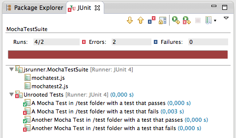

mochajs-eclipse
===============

Do you want to unit test your Node.js JavaScript inside Eclipse with Mocha.js?
Look no further.

Get started
-----------

The easy way would be:

1. Clone this repo.
2. Import this as Existing Project inside Eclipse.
3. Find MochaTestSuiteWithAnnotation Java class inside test/jsrunner directory.
4. Change the value of @TestsFolder("path-to-my-mocha-test-folder") annotation and point it to yout Mocha.js test folder.
5. Right-click Run As JUnit.
6. Enjoy.

Of course, this is a super-hack. It's not what it's supposed to be, but hey, it's a good start!
The idea is from http://js-testrunner.codehaus.org/index.html, which runs browser-side JavaScript with Phantom.js

Ok, now let's do it the way it should be
----------------------------------------

As you might have guessed, this hack is far from "the real thing". So what's the real thing?
Well, as I see it, the real thing would be a nice Eclipse plugin that runs Mocha.js tests "natively" that mimics JUnit plugin for Eclipse.

Want to join me in coding a new plugin supporting Mocha.js? 
Maybe already know a plugin that supports it and want to tell me I've been wasting my time?
Contact @eloy_iv on twitter, or leave an issue in this repo.
Be welcome!
