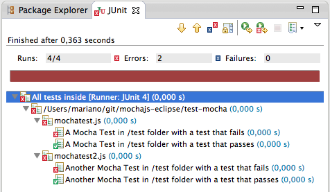

mochajs-eclipse
===============

Do you want to unit test your Node.js JavaScript inside Eclipse with Mocha.js?

Look no further.

Get started
-----------

The easy way would be:

1. Clone this repo.
2. Import this as Existing Project inside Eclipse.
3. Find MochaTestSuite Java class inside test-mocha/jsrunner directory.
4. Change the value of @TestsFolder("test-mocha") annotation and point it to your Mocha.js test folder.
5. Right-click Run As JUnit.
6. Enjoy.

Of course, this is a super-hack. It's not what it's supposed to be, but hey, it's a good start!
I saw something like this here: http://js-testrunner.codehaus.org/index.html, which runs browser-side JavaScript with Phantom.js

Known issues
------------

*A word of warning*: If your JavaScript code/tests write to the standard output, it will break the runner.
This happens because Mocha.js results also get written to STDOUT, and if it gets mixed with other stuff then the runner can't parse the results.
There are a number of [issues opened in Mocha.js](https://github.com/visionmedia/mocha/pull/469) about writing results to a file instead of STDOUT, 
but so far Mr. TJ Hollowaychuck has kept things as they are.   

Ok, now let's do it the way it should be
----------------------------------------

As you might have guessed, this hack is far from "the real thing". So what's the real thing?
Well, as I see it, the real thing would be a nice Eclipse plugin that runs Mocha.js tests "natively" that mimics JUnit plugin for Eclipse.

Want to join me in coding a new plugin supporting Mocha.js? 
Maybe already know a plugin that supports it and want to tell me I've been wasting my time?
Contact @eloy_iv on twitter, or leave an issue in this repo.
Be welcome!
